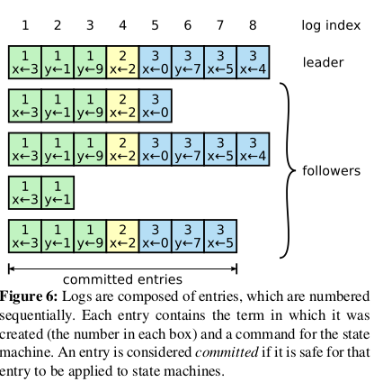

# the raft consensus algorithm

this doc is my note to reading the paper [raft-extend.pdf](./raft-extended.pdf)

## main step
- select leader
- leader accepts log entries from clients
- leader decide and tell other replicates to apply to log entries to state machine

## basic conception

### server state
- servers have only three state: leader, follower, candidate
- leader decide apply log entry, candidate redirect request to leader to decide to apply log entry.
- candidate, is used to elect a new leader.

### term

- time divided into terms, raft ensure only one leader at in a given term

- t3 no leader is elected.
- stale term will be rejected

### communicate

- raft server communicate using RPC

####  RPC types

- Request Vote 
- Append Entries
- transfer snapshots

### leader election

- followers keep follower state on condition receiving valid rpc message from candidate or leader
- followers change it follwer state on condition election timeout
- new election, increment current term, follower change it state to candidate, and vote for itself and start RequestVote RPC
- candidate win election become a new leader
- other candidate win election
- timeout no leader elected

### log replication

- leader begin to handle client request. 
- each client request contains a command.
- leader append the command as a new entry
- leader apply new entry to state machine and issue to followers in parallel
- as picture show, each entry contains a term id and unique log index, leader's log always the newest
- once the entry was replicated to on the majority of the servers, the log entry will be committed.
- follower learn the log entry committed, it applies to its local state machine

- each entry's replica have the same index and term, 
  1) store the same command
  2) identical in all preceding entries
- leader create entry with a given log index in a given term.
- when sending AppendEntries RPC, leader includes the index and term of the entry in log.
- if a follower term and index are not match, will rejected. and
  1) consistency check TODO.
#### abnormal situation

- leader crash
  1) leave logs inconsistent
  2) follower's log miss some entries.
  3) follower's log have extra entries.
- how to handle
  1) leader force the follower's logs to duplicate its own
  2) AppendEntries RPC, check the follower log's consistency.
  3) leader maintains a **nextIndex** for each follower.
  4) once the follower's log inconsistent with leaders', next AppendEntries will failed
  5) optimize the protocol TODO
  6) the Leader Append-Only Property
    
